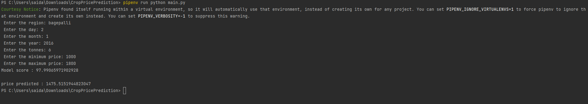
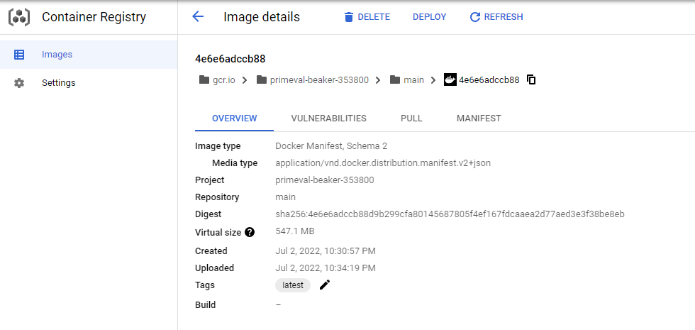
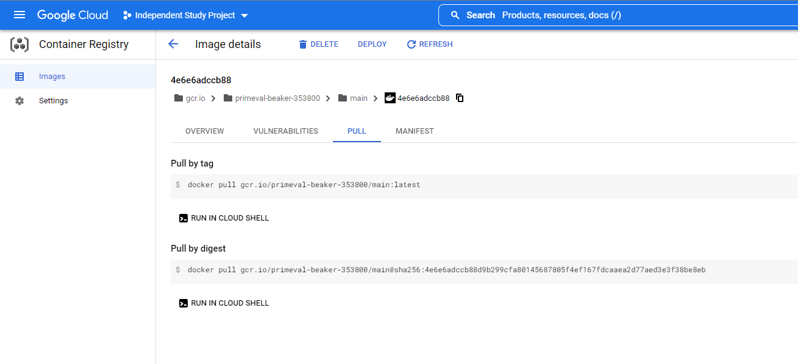
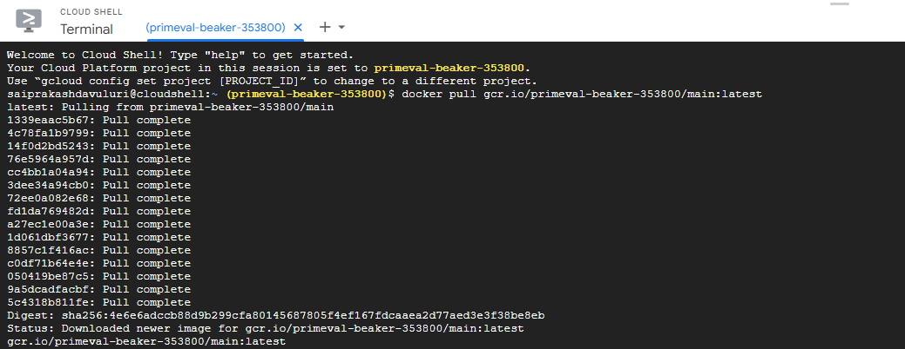
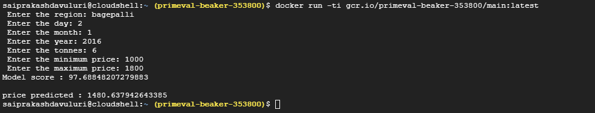

# CropPricePrediction - Independent Study - CS5990

#### Goal: The goal of the project is to apply machine learning model to predict the price of a crop on a particular date given few parameters by analyzing past dataset.

#### How to run hte project:
* Clone the repository using git clone 'URL'  from git repository.
* Navigate to the project folder by using 'cd CropPricePrediction'
* Install the required libraries using 'pipenv install'
* Run this command to execute the project: pipenv run python main.py

#### Approach:

* I have searched for a dataset that matches my problem on the internet. I found one related to the problem that I am trying to solve in the Kaggle website.
* The dataset contains records which has information like Market, Arrival Date, Arrivals (Tonnes), Variety, Minimum Price(Rs./Quintal), Maximum Price(Rs./Quintal), Modal Price(Rs./Quintal).
* First, I have read the dataset first using pandas library.
* I have analyzed the data to figure out which columns are required to run the model effectively then dropped the Variety column because it doesn't serve the purpose.
* Applied few pre-defined pandas functions to change the names of the headers in the dataframe.
* After trying out few approaches to improve model effectiveness, I figured out that breaking up the date and cleaning it would improve the prediction of a model.
* Divided the date into three columns as day, month, and year. Also, transformed the month into single digit like 01 or 02 to 1 or 2.
* After doing preprocessing, added the data to the dataframe as columns. So, the dataframe now contains headers like day, month, and year.
* As our data contains multiple columns or variables to pass as input to particular model to predict the price. I figured rather than going for traditional vectorizers like Count or TFIDF.
* I have chosen Dictvectorizer. To send the parameters to Dictvectorizer, I have consolidated every parameter in a dictionary and passed the whole data as a list.
* Now, data is ready to sent to model for prediction. I have split the data into the size of 0.2 in train_test_split method. So, 80% of data will be passed for training and 20% of data will be passed for training.
* Finally, sent the data to model to calculate the model precision score. To collect the input/interact with user the program will ask user to provide certain information like region, day, month, year, tonnes, minimum_price, and maximum_price to predict the average price.

#### Reason for choosing this model for my project:

* I have tested below models and came to the conclusion that LinearRegression model has better accuracy and results.

                          Models Tested:
                             LogisticRegression
                             Multinomial Naive Bayes 
                             RandomForestClassifier
                             DecisionTreeClassifier

#### Functions:

read_json():
* This method reads the data from excel file. 
* After reading the data, it renames the columns and removes a column called 'variety' which is not required for the project.
* Finally, returns the dataframe as output.

data_processing(df):
* This method takes dataframe as input parameter. First, three lists are defined called day, temp_month, and year.
* Using for loop, it iterates the rows in the dataframe to collect the year from every record and stores it in the year list.
* Following the same logic, to collect the month and day values I have used for loop and stored the values in temp_month and day lists.
* To transform every value in the list of temp_month to single digit, I have used for loop to iterate and used if, elif block to transform the values into single digits and stored the final values in month list.
* this method returned month, day, and year list as output.

column_addition(year, month, day, df):
* This method takes year, month, day, and df dataframe as inputs.
* The primary use of this method is to add these lists as columns to the data frame.
* After adding these lists to the dataframe, I am returning the df dataframe as output.

prepare_vectorizer(df):
* This method takes df dataframe as input parameter.
* Initially, two lists are defined D, avg_price. By iterating the records in the df dataframe. I am collecting values like region, day, month, year, tonnes, minimum_price, maximum_price in an individual dictionary and storing them in D list.
* Whilst collecting the values, I am converting the types of every value except region to either int or float to increase the precision of the model.
* The values in the avg_price column will be stored in avg_price list.
* This method produces D and avg_price as outputs.

model_prediction(D, avg_price, user_input):
* This method receives D, avg_price, and user_input as input parameters.
* In this method, I am initializing the DictVectorizer and applying fit_transform function on D list. The result will be stored as X.
* The values of avg_price will be seen as labels for the model and stored as Y.
* By using train_test_split function, I am splitting the data into x_train, x_test, y_train, y_test variables.
* Then I have fitted the model with x_train, y_train.
* To predict the average price of the produce on a particular date. I am collecting the values from the user and storing them in the form of dictionary and wrapping them in the list and sending them as inputs to the model.
* Finally, the precision score and model prediction will be printed as results.

#### Output:

#### Deployment in Google Cloud Platform:

* I have deployed the following project on docker container in local machine as well as on the Google Cloud Platform.

